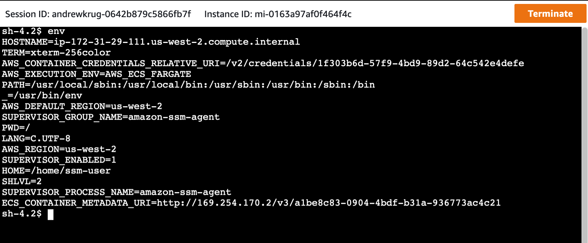

You can now use the [Cloud Debugging](https://docs.aws.amazon.com/toolkit-for-jetbrains/latest/userguide/ecs-debug.html) feature in the JetBrains IDEs to attach to a running container on ECS EC2 or ECS Fargate. Beyond attaching to a container, the AWS toolkit for JetBrains allows you to do live debugging, e.g. set breakpoints and synchronize local changes to the running container. 

# ssm-agent



> Above AWS Systems Manager is used in an interactive session with a container running in Amazon Container Services _Fargate_.  The interactive shell uses 100% https and all commands run are logged in AWS CloudTrail.

## Introduction
The SSM agent can do a variety of different things.  For example, it can inventory the software that is running on a fleet of instances. You can also run commands against those instances.  In September 2018, SSM added support for shell access to EC2 instances without running bastion hosts or distributing SSH keys.  While it was never designed to run inside of a Docker container, I thought that doing so would be interesting experiment.  

When I started, I wanted to see whether I could get the agent to run as a Fargate task because there is currently no interactive shell access for Fargate.  I quickly discovered that the default installation for EC2 assumes that you have access to EC2 metadata which is not accessible from a Fargate task in the normal location `http://169.254.169.254/latest/meta-data/`.  Instead Fargate includes a versioned API for metadata that some credential provider chains understand how to take advantage of `http://169.254.170.2/v2/credentials/1f303b6d-57f9-4bd9-89d2-64c542e4defe` where the GUID is the Task ID running in the Fargate Cluster.  A feature request has been filed with the upstream SSM-Agent project to incorporate this credential provider.

Fortunately, I was able to work around this issue by configuring the agent as a [hybrid instance](https://docs.aws.amazon.com/systems-manager/latest/userguide/systems-manager-managedinstances.html).

The next issue I encountered involved stopping and restarting the agent after configuring it to use an activation code and ID.  The agent normally runs as a systemd process, however I couldn't run systemctl without privileged access so I had to find another work around.  I eventually stumbled across a project by Guido Draheim called [docker-systemctl-replacement](https://github.com/gdraheim/docker-systemctl-replacement) that allows you to run systemd controlled containers without starting the systemd daemon.  With this I could stop and restart the agent which was all that I needed to add the Fargate task as a "managed instance".

Getting the interactive shell working was the last and final hurdle. Ordinarily the agent adds the ssm-user to the instance during the install, but when it runs in a container you have to manually add it.  Once I added the ssm-user to the container image, I was able to successfully start an interactive shell with the task. 

## Running the SSM agent
Before building the image from the Dockerfile in the repository, you will need to update the entrypoint.sh script with the SSM activation code, ID, and region.  For instructions explaining how to setup a hybrid environment including how to create an activation, see https://docs.aws.amazon.com/systems-manager/latest/userguide/systems-manager-managedinstances.html.

## Running the Fargate task
The repository includes a sample task definition for running the SSM agent as a Fargate task and a set of `Makefile` targets that help with setup.

## The example
Getting the agent running as a Fargate task is a great accomplishment, but it's not that useful unless you can use it to interact with other applications running in the container, e.g. NGINX or Redis.  Docker provides a couple of examples of how you can [run multiple service in a container](https://docs.docker.com/config/containers/multi-service_container/). The example [in the example directory] uses supervisord to run the SSM agent and Redis.  

## Automated Setup Using the Makefile
A make target was added to simplify deploying a working demo of the project.  Follow the DIY steps above **or** run the following commands on a machine with Make, the awscli, and administrator level access.

**Step 1**
```
make create-ssm-role
make create-activation

aws ssm create-activation --default-instance-name FargateContainers --iam-role AutomationServiceRole --registration-limit 100 --region us-west-2 --tags "Key=App,Value=FargateDemo"
{
    "ActivationId": "000-0000-0000",
    "ActivationCode": "xyz1234567"
}
```

**Step 2**

Take that activation and ID and put them in the entrypoint scripts prior to building the demo containers.
They are in files/entrypoint.sh and examples/redis/files/entrypoint.sh respectively.  

> Note: Do not do this in production as these are only for demo purposes and likely this should be replaced with secrets manager or parameter store.  Activations are only good for 24 hours.  Do not leak these by committing them to github.

**Step 3**

Setup the rest of the tasks.

```
make setup
make build
make push
make create-task-role
make render-parameters
make create-task
```

> Note: This does not create a fargate cluster in awsvpc mode for you.  You'll need to do that and run the task on your own.
